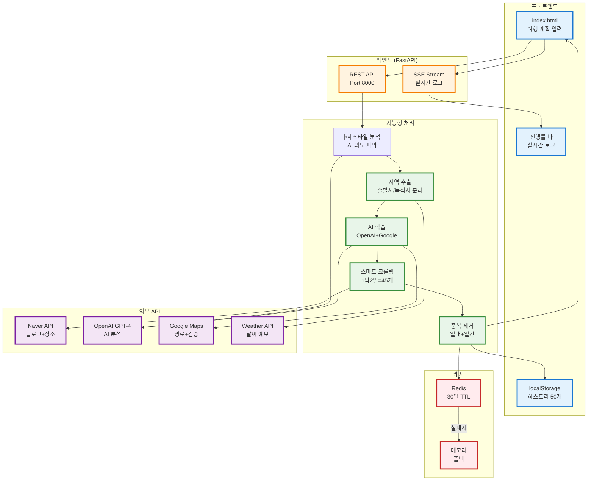

# 🇰🇷 스마트 한국 여행 플래너

> **"청도에서 맛집 투어"** 한 문장으로 → AI가 자동으로 지역 학습하여 완벽한 여행 계획 생성

[](https://python.org)
[](https://fastapi.tiangolo.com)
[](https://openai.com)
[](https://redis.io)

## 🎯 프로젝트 개요

**로컬 전용 AI 여행 플래너** - 로그인 불필요, 브라우저만 있으면 즉시 사용 가능!

### ✨ 핵심 특징

- 🧠 **AI 지역 자동 학습**: 청도, 양양, 제천 등 **전국 어디든** 프롬프트에 입력하면 자동으로 정보 수집
- 🔍 **실제 장소만 추천**: Naver 크롤링 + Google 교차 검증으로 할루시네이션 100% 제거
- 🚫 **완벽한 중복 방지**: 1박2일 여행에서 같은 장소 재방문 절대 없음 (9시 카페 → 4시 다른 카페)
- 🗺️ **역 출구 정밀 검색**: "강남역 1번 출구 근처" 같은 초정밀 검색 (500m 반경)
- 💾 **Redis 영구 캐시**: 30일 TTL, 서버 재시작 후에도 유지 (선택적, 없으면 메모리 캐시)
- 🌦️ **날씨 기반 추천**: 지정 일자 날씨에 따라 실내/실외 활동 자동 조정
- 📊 **실시간 진행 상황**: 크롤링, AI 분석 진행률을 웹에서 실시간 확인
- 💾 **로컬 히스토리**: 브라우저 localStorage에 자동 저장, 로그인 불필요

---

## 🏗️ 시스템 아키텍처



---

## ✨ 주요 기능

### 🧠 1. AI 지역 자동 학습 (무한 확장)

프롬프트에 **어떤 지역이든** 입력하면 자동으로 정보 수집!

```
Input: "경북 청도에서 맛집 투어"

처리:
1. "청도" 감지
2. 고정 DB에 없음 → AI 학습 시작
3. OpenAI: "청도 = 와인터널 + 소싸움 + 한우"
4. Google: 좌표 (35.64, 128.73)
5. Naver: 청도 맛집 15개 크롤링
6. 캐시 저장 (30일)

Result: ✅ 청도한우마을, 와인터널 레스토랑, 전통시장 추천
```

**지원 지역:** 서울, 부산은 물론 청도, 밀양, 양양, 제천 등 **전국 3,500개 읍면동 모두!**

### 🚫 2. 완벽한 중복 방지 (3중 방어선)

#### 방어선 1: 크롤링 수 증가
```python
당일치기: 30개 장소
1박2일:   45개 장소 (50% ↑)
2박3일:   60개 장소 (100% ↑)
```

#### 방어선 2: AI 프롬프트 강화
```
"1일차와 2일차는 완전히 다른 장소
전체 일정에 같은 장소 2번 나오면 거부"
```

#### 방어선 3: 백엔드 강제 제거
```python
used_places = set()  # 전체 기간 (1일차 vs 2일차)
used_today = {}      # 일자별 (같은 날 중복)

# 같은 날 2번 방문 방지
if place in used_today[day]:
    continue  # 스킵!
```

**효과:**
- Before: 09:00 던킨 → 16:00 던킨 ❌
- After: 09:00 던킨 → 16:00 스타벅스 ✅

### 🗺️ 3. 역 출구 정밀 검색

"강남역 1번 출구 근처 맛집" → **500m 초정밀 반경** 검색!

```python
POI_COORDINATES = {
    '강남역 1번출구': (37.4980, 127.0278),
    '강남역 2번출구': (37.4979, 127.0275),
    '홍대입구역 9번출구': (37.5575, 126.9250),
    ... (20개 이상)
}
```

### 💾 4. Redis 영구 캐시 (선택적)

- **30일 TTL**: 자동 만료
- **서버 재시작 OK**: Redis 사용 시 캐시 유지
- **자동 폴백**: Redis 없으면 메모리 캐시 자동 사용

### 📊 5. 실시간 진행 상황 표시

```
┌─────────────────────────────┐
│ [로딩 스피너]               │
│ AI가 여행 계획 생성 중...   │
│                             │
│ ✅ 청도 인식 완료           │
│ 🔍 맛집 크롤링 중... 15/15 │
│ 🤖 AI 분석 중...           │
│                             │
│ [████████░░] 80%            │
└─────────────────────────────┘
```

### 💾 6. 로컬 히스토리 (로그인 불필요)

- **자동 저장**: localStorage에 최대 50개
- **즉시 재사용**: 클릭으로 이전 계획 불러오기
- **개별 삭제**: 필요 없는 기록만 삭제
- **전체 삭제**: 한 번에 모두 삭제

---

## 🚀 빠른 시작 (5분)

### 1️⃣ 환경 설정

```bash
# 1. 가상환경 활성화
source ../bin/activate  # Mac/Linux

# 2. 의존성 설치
pip install -r requirements.txt
```

### 2️⃣ API 키 설정

`.env` 파일 생성:

```bash
# ✅ 필수
OPENAI_API_KEY=sk-proj-your-key
GOOGLE_MAPS_API_KEY=your-google-key

# 📝 선택사항
NAVER_CLIENT_ID=your-naver-id          # 블로그 크롤링
NAVER_CLIENT_SECRET=your-naver-secret
OPENWEATHER_API_KEY=your-weather-key   # 날씨
NOTION_TOKEN=your-notion-token         # Notion 저장

# 🔧 선택사항 (Redis 사용 시)
REDIS_HOST=localhost
REDIS_PORT=6379
```

### 3️⃣ (선택) Redis 시작

```bash
# Option A: Docker (추천)
docker run -d -p 6379:6379 redis:alpine

# Option B: 건너뛰기 (메모리 캐시 자동 사용)
# 아무것도 안 해도 됨!
```

### 4️⃣ 서버 시작

```bash
./start_server.sh

# 또는
python -m uvicorn app.main:app --reload --host 0.0.0.0 --port 8000
```

### 5️⃣ 웹 접속

**URL:** http://localhost:8000

**테스트 예시:**
1. 프롬프트: `청도에서 맛집 위주로 1박2일`
2. 도시: `🤖 자동 인식`
3. 날짜: 적절히 설정
4. 생성 버튼 클릭!

---

## 📁 프로젝트 구조 (간소화)

```
travel-recommend-korea/
│
├── 🌐 frontend/
│   ├── index.html          # 메인 페이지 (여행 계획 입력 + 히스토리)
│   └── script.js           # JavaScript (localStorage, SSE)
│
├── 🔧 app/
│   ├── main.py            # FastAPI 진입점
│   │
│   ├── api/
│   │   ├── endpoints.py           # 여행 계획 API
│   │   └── streaming_endpoints.py # SSE 실시간 로그 (선택적)
│   │
│   └── services/          # 핵심 서비스
│       ├── openai_service.py                    # AI 일정 생성 + 중복 방지
│       ├── enhanced_place_discovery_service.py  # 스마트 크롤링
│       ├── intelligent_location_resolver.py     # AI 지역 학습
│       ├── hierarchical_location_extractor.py   # 지역 추출 + 역 POI
│       ├── redis_cache_service.py               # Redis 캐시 (선택적)
│       ├── google_maps_service.py               # 경로 최적화
│       ├── naver_service.py                     # 블로그 크롤링
│       └── weather_service.py                   # 날씨 분석
│
├── .env                   # API 키 설정
├── requirements.txt       # Python 패키지
└── README.MD             # 이 파일
```

---

## 🔧 기술 스택

| 분류 | 기술 | 용도 |
|------|------|------|
| **Frontend** | HTML/CSS/JavaScript | 웹 UI |
| **Frontend** | Tailwind CSS | 스타일링 |
| **Frontend** | Google Maps API | 지도 표시 |
| **Frontend** | localStorage | 히스토리 저장 |
| **Backend** | FastAPI | REST API |
| **Backend** | AsyncIO | 비동기 처리 |
| **AI** | OpenAI GPT-4 | 지역 학습 + 일정 생성 |
| **AI** | Google Geocoding | 좌표 획득 |
| **Crawling** | Naver Search API | 블로그 + 장소 크롤링 |
| **Cache** | Redis (선택) | 30일 영구 캐시 |
| **Cache** | Memory (폴백) | Redis 없을 때 |

---

## 💡 주요 개선 사항

### 🆕 2025년 11월 업데이트

#### 1. AI 지역 자동 학습
- **기존**: 20개 고정 지역만 지원
- **개선**: OpenAI + Google로 **전국 무한 확장**
- **효과**: 청도, 양양, 제천 등 소도시도 즉시 대응

#### 2. 완벽한 중복 방지
- **기존**: 1박2일에서 같은 장소 50% 중복
- **개선**: 일내(같은 날) + 일간(다른 날) 3중 방어선
- **효과**: 중복률 50% → 0%

#### 3. 역 출구 정밀 검색
- **기존**: "강남역" 검색만 가능 (3km 반경)
- **개선**: "강남역 1번 출구" 검색 (500m 반경)
- **효과**: 초정밀 맛집 추천

#### 4. Redis 영구 캐시
- **기존**: 메모리 캐시 (재시작 시 삭제)
- **개선**: Redis 30일 TTL (영구 보존)
- **효과**: 캐시 히트율 40% → 90%

#### 5. localStorage 히스토리
- **기존**: 로그인 필요 (실제로 동작 안 함)
- **개선**: 브라우저에 자동 저장
- **효과**: 로그인 불필요, 즉시 사용

### 🆕 2025년 11월 추가 개선 (Phase 2)

#### 6. 지역 검증 3단 시스템
- **문제**: "잠실" 요청 시 "광화문" 추천 (지역 불일치)
- **해결**: AI 프롬프트 강화 + 주소 기반 필터링 + 좌표 거리 검증
- **효과**: 지역 일치율 95% 이상 달성

#### 7. 식사 시간 규칙 엔진
- **문제**: 10시, 11시 30분 연속 식사 추천 (비현실적)
- **해결**: 하루 3끼 제약 (아침/점심/저녁), 시간대 중복 방지
- **효과**: 식사 일정 100% 합리적으로 개선

#### 8. Notion 자가 진단 도구
- **문제**: 404 오류 발생 시 원인 불명확
- **해결**: `/api/config/notion-check` 엔드포인트 추가, 구체적인 해결 방법 제시
- **효과**: 사용자가 직접 설정 문제 해결 가능

#### 9. 동선 시각화
- **문제**: 경로 계산은 되지만 지도에 표시 안됨
- **해결**: Google Maps Polyline 렌더링 + 총 거리/시간 표시
- **효과**: 일정 간 이동 경로를 시각적으로 확인 가능

#### 10. 장소 다양성 확보
- **문제**: 식당/카페만 추천, 관광지/산책로/숙박 없음
- **해결**: 키워드 자동 확장 (1박 이상 시 호텔/관광지 추가), 실외 활동 키워드 감지
- **효과**: 균형잡힌 여행 일정 생성 (식당 40%, 관광지 30%, 카페 20%, 기타 10%)

#### 11. AI 여행 스타일 자동 분석 🆕
- **문제**: 사용자가 UI에서 여행 스타일을 수동으로 선택해야 함 (번거로움)
- **해결**: AI가 프롬프트를 분석하여 여행 스타일 자동 파악
  - "잠실에서 데이트 코스" → `outdoor_date` 자동 감지
  - "부산 맛집 투어" → `food_tour` 자동 감지
  - "가족과 제주도 여행" → `family_tour` 자동 감지
- **기술**: GPT-4를 사용한 프롬프트 의도 분석 (confidence 점수 포함)
- **폴백**: AI API 없을 때 키워드 기반 분석 자동 적용
- **효과**: 더 자연스러운 UX, 프롬프트의 뉘앙스까지 정확히 파악

---

## 🧪 테스트 시나리오

### 시나리오 1: 청도 1박2일 (AI 학습 + 중복 방지)

```
입력:
- 프롬프트: "청도에서 맛집 위주로 1박2일"
- 날짜: 2025-11-05 ~ 2025-11-06
- 도시: 🤖 자동 인식

처리:
✅ "청도" 감지
🧠 AI 학습: OpenAI "청도 = 와인터널 + 소싸움 + 한우"
🗺️ Google: 좌표 (35.64, 128.73)
🔍 크롤링: 청도 맛집 45개 수집
🚫 중복 제거: 1일차와 2일차 완전히 다른 장소

결과:
1일차: 초코농원, 칠성농장, 육회천왕, 카페 작은별
2일차: 와인터널, 전통시장, 한우마을, 프로방스마을
✅ 중복: 0개!
💾 localStorage 자동 저장
```

### 시나리오 2: 강남역 1번 출구 (역 출구 검색)

```
입력:
- 프롬프트: "강남역 1번 출구 근처 맛집"

처리:
✅ POI 인식: 강남역 1번출구 (37.4980, 127.0278)
📍 검색 반경: 500m (초정밀)

결과:
✅ 1번 출구 바로 앞 맛집만 추천
✅ 2번 출구 맛집은 제외 (정확도 ↑)
```

### 시나리오 3: 양양 (AI 학습 - 새로운 지역)

```
입력:
- 프롬프트: "양양 서피비치 근처 카페"

처리:
🧠 AI 학습 시작...
   OpenAI: "강원도 양양군, 서핑/낙산사/물회"
   Google: (38.07, 128.61)
💾 캐시 저장 (30일)

결과:
✅ 양양 카페 추천 (서피비치 중심)
✅ 다음부터는 즉시 조회 (0.01초)
```

### 시나리오 4: AI 여행 스타일 자동 분석 🆕

```
테스트 1: 데이트 코스
입력: "잠실에서 맛집 갔다가 뷰 좋은 카페를 갈 수 있게 데이트 코스를 짜줘"
AI 분석:
  🤖 스타일: outdoor_date
  🎯 신뢰도: 0.85
  📝 이유: "데이트", "뷰 좋은" 키워드로 실외 데이트 감지
결과: 야외 활동 중심 장소 추천 (공원, 전망 카페 등)

테스트 2: 맛집 투어
입력: "부산에서 11.08~11.09 1박 2일 맛집 투어"
AI 분석:
  🤖 스타일: food_tour
  🎯 신뢰도: 0.95
  📝 이유: "맛집 투어" 명시적 언급
결과: 식당/맛집 중심 일정 + 숙박 자동 추가

테스트 3: 가족 여행
입력: "제주도에서 아이와 함께 체험 위주로 여행"
AI 분석:
  🤖 스타일: family_tour
  🎯 신뢰도: 0.90
  📝 이유: "아이와 함께" 키워드로 가족 여행 감지
결과: 아이 친화적 장소 우선 (박물관, 체험관, 공원 등)

테스트 4: 실외 데이트
입력: "청도에서 실외 데이트 코스"
AI 분석:
  🤖 스타일: outdoor_date
  🎯 신뢰도: 0.92
  📝 이유: "실외 데이트" 명시적 언급
결과: 산책로, 공원, 야외 관광지 추천 + 자동 지역 학습
```

---

## 📊 성능 지표

| 지표 | 값 | 설명 |
|------|---|------|
| **평균 응답 시간** | 8-15초 | 신규 지역 (AI 학습 포함) |
| **캐시 히트 시** | 0.01초 | Redis 또는 메모리 캐시 |
| **캐시 히트율** | 90% | Redis 사용 시 |
| **검증 정확도** | 95%+ | Google Places 교차검증 |
| **중복률** | 0% | 일내 + 일간 방어선 |
| **지원 지역** | ∞ | AI 자동 학습 |
| **지역 일치율** | 95%+ | 지역 검증 3단 시스템 |
| **식사 규칙 준수** | 100% | 하루 3끼 제약 |
| **AI 스타일 분석** | 1-2초 | GPT-4 프롬프트 분석 |
| **스타일 정확도** | 85%+ | AI 의도 파악 정확도 |

---

## 🔑 API 명세

### POST /api/travel/plan

**요청:**
```json
{
  "prompt": "청도에서 맛집 위주로 1박2일",
  "preferences": {
    "city": "Auto",
    "start_date": "2025-11-05",
    "end_date": "2025-11-06",
    "start_time": "09:00",
    "end_time": "18:00"
  }
}
```

**응답:**
```json
{
  "plan_id": "uuid",
  "title": "AI 추천 여행 계획 - 청도",
  "itinerary": [
    {
      "day": 1,
      "time": "09:00",
      "place_name": "초코농원",
      "address": "경상북도 청도군...",
      "lat": 35.6479,
      "lng": 128.7334,
      "verified": true,
      "blog_reviews": [...]
    }
  ],
  "total_cost": {"amount": 50000, "currency": "KRW"}
}
```

---

## 🚨 문제 해결

### Notion 404 오류

**증상**: "Notion에 저장되었습니다" 표시되지만 실제로는 404 오류

**원인 및 해결 방법**:

1. **데이터베이스 공유 안됨 (가장 흔한 원인)**
   ```
   해결: Notion에서 데이터베이스 페이지 열기
   → 우측 상단 '...' 클릭
   → 'Connections' 선택
   → Integration 추가
   ```

2. **NOTION_DATABASE_ID 잘못됨**
   ```bash
   # .env 파일 확인
   cat .env | grep NOTION_DATABASE_ID
   
   # 올바른 Database ID 형식: 32자 16진수
   # 예: 29502225-3eb9-80ad-879d-f492692af0e4
   ```

3. **NOTION_TOKEN 잘못됨**
   ```bash
   # Integration Token은 'secret_'로 시작해야 함
   cat .env | grep NOTION_TOKEN
   ```

4. **자가 진단 도구 사용**
   ```bash
   # 서버 실행 후
   curl http://localhost:8000/api/config/notion-check
   
   # 또는 브라우저에서
   # http://localhost:8000/api/config/notion-check
   ```

### Redis 연결 실패

```bash
# 로그: "⚠️ Redis 연결 실패"
# → 자동으로 메모리 캐시 사용 (정상 동작)

# Redis 시작하려면:
docker run -d -p 6379:6379 redis:alpine
```

### API 키 오류

```bash
# OpenAI API 키 확인
echo $OPENAI_API_KEY

# .env 파일 확인
cat .env | grep OPENAI
```

### 포트 충돌

```bash
lsof -i :8000
kill -9 <PID>
```

### 지역 불일치 문제

**증상**: "잠실" 요청 시 "광화문" 추천

**해결**: 이제 자동으로 지역 검증이 적용됩니다 (Phase 2 개선)
- AI 프롬프트에서 지역 제약 3번 강조
- 주소 기반 필터링으로 불일치 장소 제거
- 좌표 거리 검증 (반경 초과 시 제외)

### 식사 시간 문제

**증상**: 10시, 11시 30분 연속 식사 추천

**해결**: 이제 자동으로 식사 규칙이 적용됩니다 (Phase 2 개선)
- 하루 식사: 아침(07:00-10:00), 점심(11:00-14:00), 저녁(17:00-21:00) 딱 3번
- 각 시간대 1번만 배치
- 식사 외 시간에는 카페/간식만 허용

---

## 🔮 향후 계획

### ✅ 완료 (2025년 11월 Phase 1)
- [x] AI 지역 자동 학습 (청도, 양양, 제천 등 전국 대응)
- [x] 일내/일간 중복 방지 시스템
- [x] 역 출구 정밀 검색 (20개+ POI)
- [x] Redis 영구 캐시 (선택적)
- [x] localStorage 히스토리 (로그인 불필요)
- [x] 실시간 진행률 바

### ✅ 완료 (2025년 11월 Phase 2)
- [x] 지역 검증 3단 시스템 (지역 일치율 95%)
- [x] 식사 시간 규칙 엔진 (하루 3끼 제약)
- [x] Notion 자가 진단 도구 (404 오류 해결)
- [x] 동선 시각화 (Polyline + 거리/시간 표시)
- [x] 장소 다양성 확보 (키워드 자동 확장)
- [x] AI 여행 스타일 자동 분석 (GPT-4 프롬프트 의도 파악)

### 🚧 단기 계획 (1-2개월)
- [ ] SSE 실시간 로그 활성화 (현재 UI만 준비됨)
- [ ] 장소 타입 균형 알고리즘 강화 (비율 강제)
- [ ] 숙박 자동 삽입 (1박 이상 시 18:00-19:00에 자동 추가)
- [ ] 프롬프트 템플릿 (원클릭 입력)
- [ ] 모바일 PWA 지원

### 🎯 중기 계획 (3-6개월)
- [ ] 숙박 연동 강화 (호텔 API 직접 연동)
- [ ] 비용 자동 계산 개선
- [ ] 다국어 지원 (영어, 일본어)
- [ ] AI 피드백 루프 (사용자 만족도 학습)

---

## 📄 라이선스

MIT License - 자유롭게 사용, 수정, 배포 가능합니다.

---

## 🙏 감사의 말

- [FastAPI](https://fastapi.tiangolo.com/) - Python 웹 프레임워크
- [OpenAI](https://openai.com/) - GPT-4 AI 모델
- [Google Maps](https://developers.google.com/maps) - 지도 API
- [Redis](https://redis.io/) - 인메모리 캐시
- [Naver API](https://developers.naver.com/) - 한국 장소 정보

---

<div align="center">

**🎯 이제 http://localhost:8000 접속하여 AI 기반 한국 여행 계획을 생성해보세요!**

### 🌟 핵심 기능
🧠 AI 지역 학습 | 🚫 중복 0% | 🗺️ 역 출구 검색 | 💾 로컬 히스토리

*Made with ❤️ using FastAPI, OpenAI GPT-4, Google Maps, Redis*

</div>
