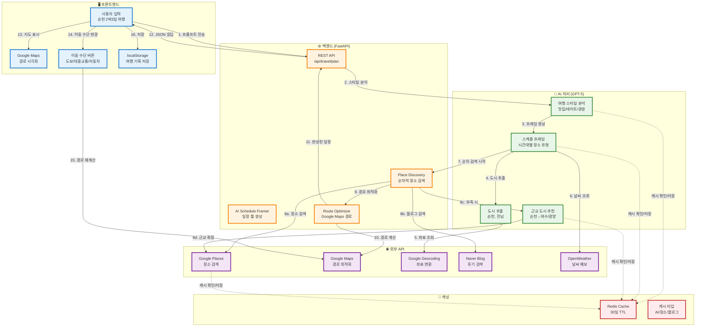
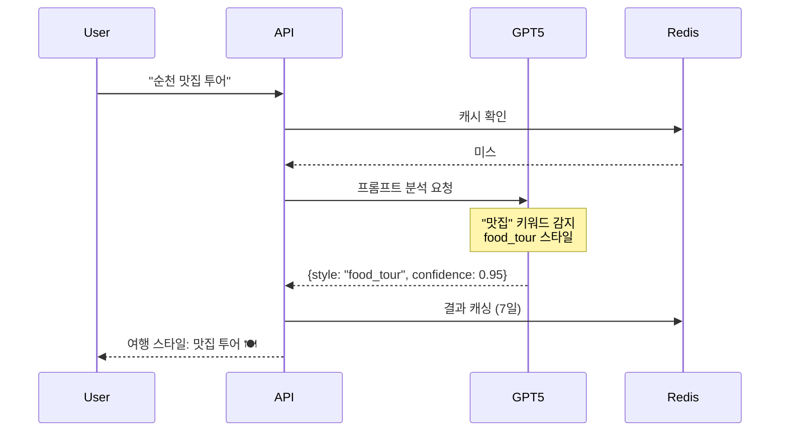
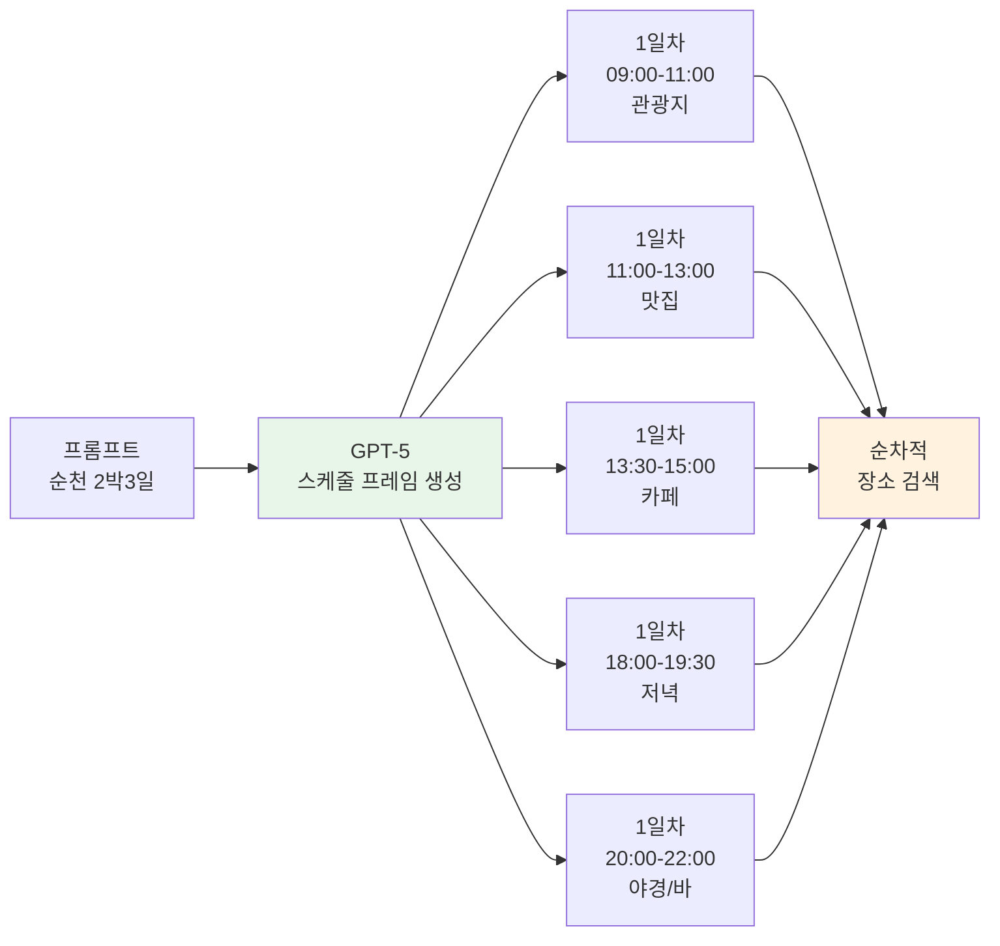
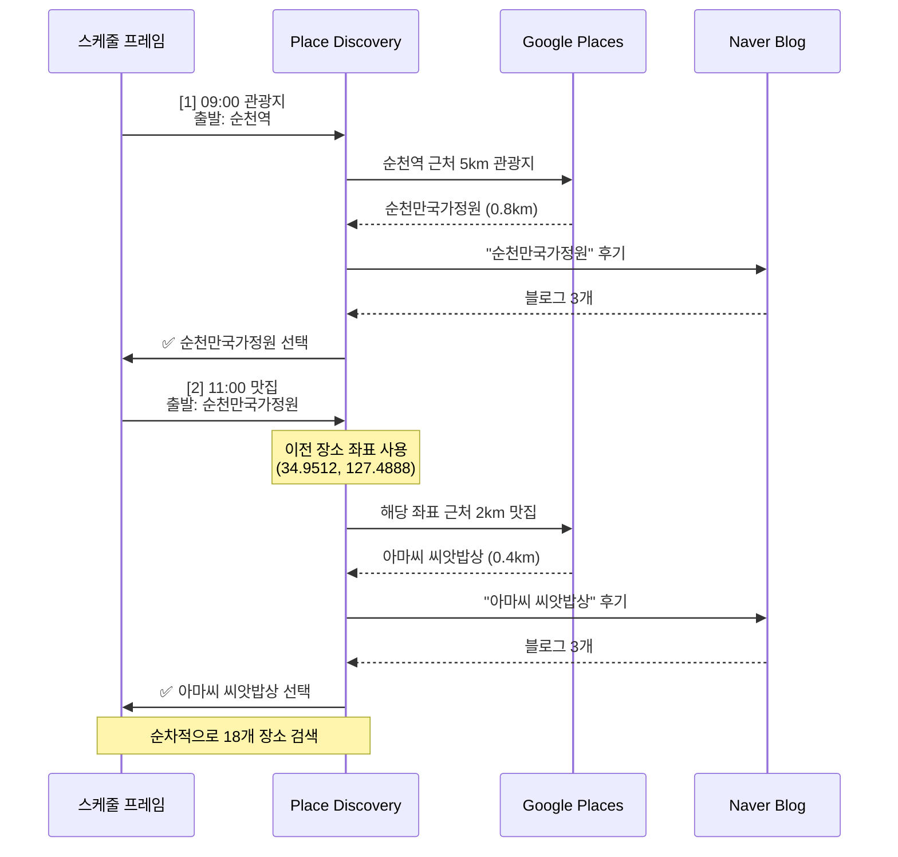
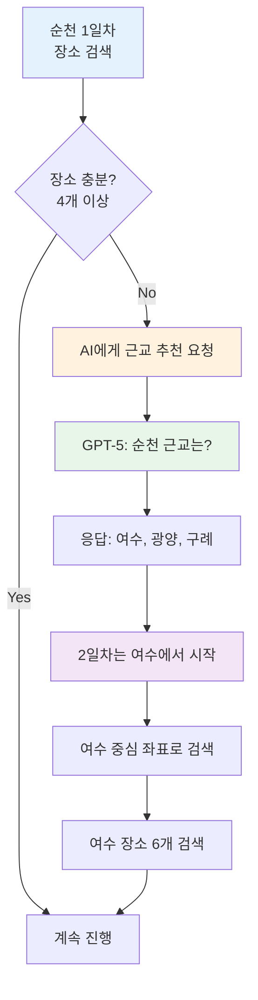
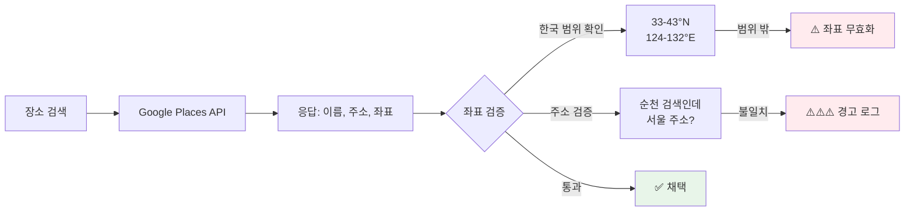
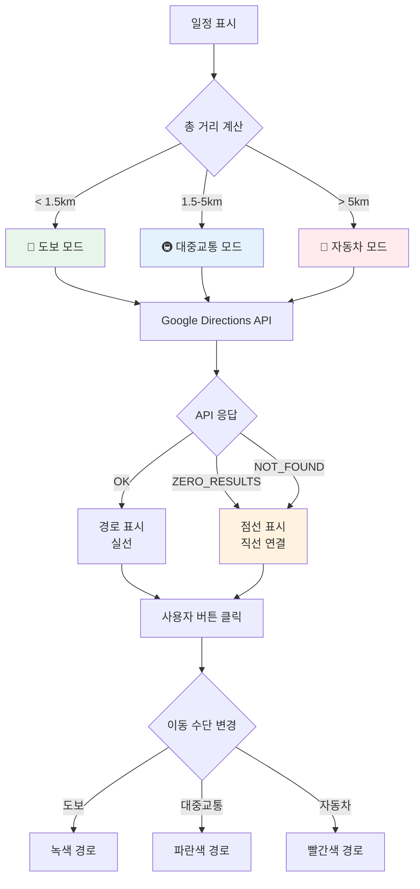
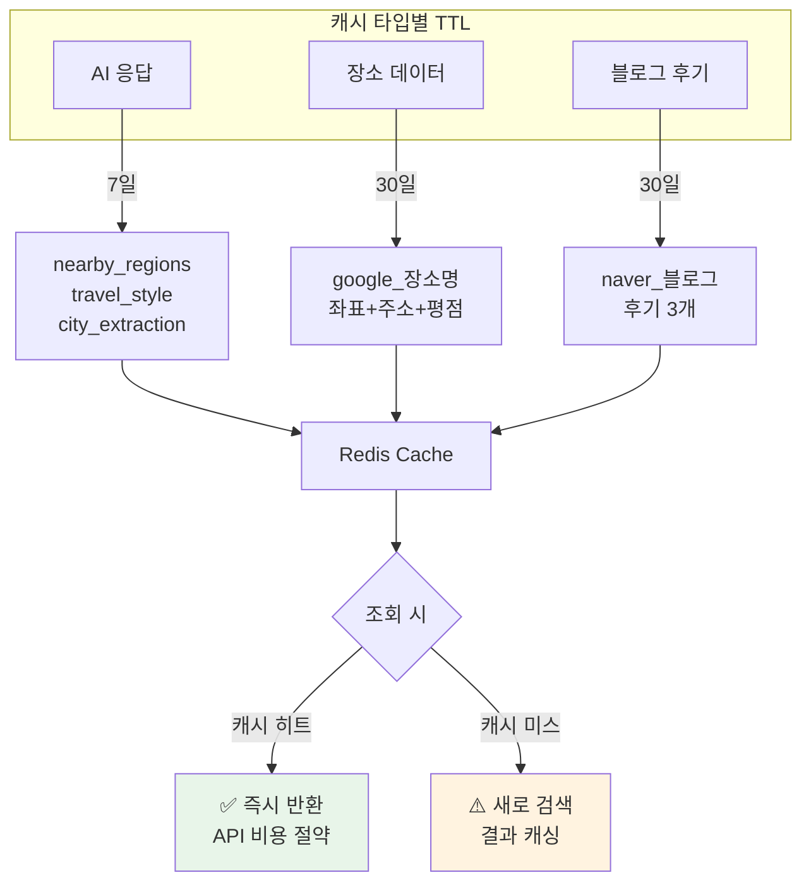

# 🇰🇷 AI 기반 한국 여행 플래너

> **"순천 2박3일 여행"** 한 문장으로 → AI가 자동으로 완벽한 여행 일정 생성

[](https://python.org)
[](https://fastapi.tiangolo.com)
[](https://openai.com)
[](https://redis.io)

---

## 🎯 프로젝트 개요

**로그인 불필요, 100% 로컬 실행** - 브라우저만 있으면 즉시 사용 가능!

### ✨ 핵심 특징

- 🤖 **GPT-5 기반 여행 스타일 자동 분석**: 프롬프트만으로 여행 의도 파악 (맛집 투어, 실외 데이트 등)
- 🗓️ **AI 스케줄 프레이머**: 시간대별 최적 장소 유형 자동 결정 (11시 점심, 13:30 카페, 18시 저녁)
- 🔍 **순차적 장소 검색**: 이전 장소 기반으로 다음 장소 검색 (동선 최적화)
- 🌐 **Google Places API**: 실제 장소만 추천 (좌표, 주소, 평점 포함)
- 📝 **Naver 블로그 후기**: 각 장소마다 실제 방문 후기 3개 수집
- 🌦️ **날씨 기반 추천**: 5일 이내 실제 예보, 이후 계절별 추천
- 🏙️ **동적 근교 확장**: 장소 부족 시 AI가 근교 도시 자동 추천
- 💾 **Redis 캐싱**: AI 응답 및 장소 데이터 30일 캐시
- 🗺️ **Google Maps 경로**: 도보/대중교통/자동차 자동 선택 및 점선 fallback
- 📊 **좌표 검증**: 서울↔순천 같은 비정상 경로 자동 감지

---

## 🏗️ 전체 시스템 아키텍처



---

## 🚀 주요 기능

### 1️⃣ AI 여행 스타일 자동 분석



**지원 스타일**:
- `food_tour`: 맛집 투어 🍽️
- `outdoor_date`: 실외 데이트 🌳
- `indoor_date`: 실내 데이트 🏢
- `culture_tour`: 문화 탐방 🏛️
- `shopping_tour`: 쇼핑 투어 🛍️
- `healing_tour`: 힐링 여행 🧘
- `adventure_tour`: 액티비티 🎢
- `night_tour`: 야경 투어 🌃
- `family_tour`: 가족 여행 👨‍👩‍👧

### 2️⃣ AI 스케줄 프레이머 (시간대별 장소 유형 결정)



**특징**:
- ✅ 시간대별 적절한 장소 유형 자동 결정
- ✅ 같은 유형 연속 방지 (카페 → 카페 X)
- ✅ 반경 자동 조정 (오전 5km, 점심 후 2km, 야간 3km)
- ✅ 날씨 정보 반영 (비 예상 시 실내 활동)
- ✅ Fallback: GPT-5 실패 시 규칙 기반 생성

### 3️⃣ 순차적 장소 검색 (동선 최적화)



**핵심 로직**:
```python
# 이전 장소의 좌표를 다음 검색의 중심으로 사용
current_location = (34.9512, 127.4888)  # 순천만국가정원

# 다음 장소 검색 (2km 반경)
next_places = await google_places.search_nearby(
    query="순천 맛집",
    location=current_location,
    radius=2000  # 2km
)

# 가장 가까운 장소 선택 → 동선 최적화
selected = min(next_places, key=lambda p: distance(current_location, p))
```

### 4️⃣ 동적 근교 지역 확장



**예시**:
```
📅 순천 2박3일 여행

1일차 (순천):
- 09:00 순천만국가정원
- 11:00 맛집
- 13:30 카페
- 18:00 저녁

2일차 (여수):  ← AI가 자동 확장
- 09:00 여수 해상케이블카
- 11:00 여수 맛집
- 13:30 여수 카페
...
```

### 5️⃣ 좌표 검증 및 디버깅



**디버깅 로그 예시**:
```
🔍 Google Places 검색: '순천 맛집'
   📍 검색 중심: (34.9479, 127.4988) - 순천
   📏 검색 반경: 2.0km

   🔍 [1] 아마씨 씨앗밥상
      좌표: (34.9480, 127.4976)
      주소: 전라남도 순천시 조곡동 역전2길 50
      📍 주소 지역: 순천/전남
      ✅ 채택! 거리: 0.12km

   🔍 [2] 서울식당
      좌표: (37.5665, 126.9780)
      주소: 서울특별시 중구...
      📍 주소 지역: 서울
      ⚠️⚠️⚠️ 경고: 순천 검색인데 서울 주소!
      ❌ 거리 초과: 290.00km (>2.0km)
```

### 6️⃣ 프론트엔드 경로 표시



**특징**:
- ✅ 거리 기반 자동 이동 수단 선택
- ✅ ZERO_RESULTS 시 점선 직선으로 대체
- ✅ 버튼 클릭으로 이동 수단 변경 가능
- ✅ 지역 불일치 자동 감지 (서울↔순천 경고)

### 7️⃣ Redis 캐싱 전략



**캐시 키 예시**:
```python
# AI 응답 캐시
ai_nearby_regions_순천_2일 = ["여수", "광양", "구례"]
ai_travel_style_순천_맛집_투어 = {"style": "food_tour", "confidence": 0.95}

# 장소 데이터 캐시
google_순천_맛집 = [
    {"name": "아마씨 씨앗밥상", "lat": 34.9480, "lng": 127.4976, ...},
    {"name": "순천양조장", "lat": 34.9474, "lng": 127.4988, ...}
]

# 블로그 후기 캐시
naver_blog_순천만국가정원 = [
    {"title": "순천만 가을 여행 후기", "url": "...", ...},
    {"title": "순천만 국가정원 데이트", "url": "...", ...}
]
```

---

## 🛠️ 기술 스택

### 백엔드
- **FastAPI**: 비동기 REST API 서버
- **Python 3.11+**: 비동기 프로그래밍
- **Redis**: 캐싱 레이어 (선택적)
- **aiohttp**: 비동기 HTTP 클라이언트

### AI & 외부 API
- **OpenAI GPT-5**: 여행 스타일 분석, 스케줄 프레이밍, 근교 추천
- **Google Places API**: 장소 검색 (Text Search)
- **Google Maps Directions API**: 경로 최적화
- **Google Geocoding API**: 주소 → 좌표 변환
- **Naver Blog Search API**: 여행 후기 수집
- **OpenWeather API**: 날씨 예보 (5일)

### 프론트엔드
- **HTML5 + Tailwind CSS**: 반응형 UI
- **Vanilla JavaScript**: Google Maps 통합
- **localStorage**: 여행 기록 저장 (최대 50개)

---

## 📦 설치 및 실행

### 1. 환경 변수 설정

`.env` 파일 생성:
```bash
# OpenAI API (필수)
OPENAI_API_KEY=sk-your-openai-api-key

# Google Maps API (필수)
GOOGLE_MAPS_API_KEY=your-google-maps-api-key

# Naver API (필수)
NAVER_CLIENT_ID=your-naver-client-id
NAVER_CLIENT_SECRET=your-naver-client-secret

# OpenWeather API (선택)
OPENWEATHER_API_KEY=your-openweather-key

# Redis (선택)
REDIS_HOST=localhost
REDIS_PORT=6379

# 기능 플래그
USE_SCHEDULE_FRAMER=true  # AI 스케줄 프레이머 사용
```

### 2. 빠른 시작 (권장)

```bash
# 저장소 클론
git clone <repository-url>
cd travel-recommend-korea

# 빠른 시작 스크립트 실행
chmod +x quickstart.sh
./quickstart.sh
```

**quickstart.sh**가 자동으로:
- ✅ Python 가상환경 생성 (`.venv`)
- ✅ 의존성 설치 (`requirements.txt`)
- ✅ Redis Docker 컨테이너 시작
- ✅ FastAPI 서버 시작 (`http://localhost:8000`)

### 3. 수동 설치

```bash
# 1. Python 가상환경 생성 및 활성화
python -m venv .venv
source .venv/bin/activate  # Windows: .venv\Scripts\activate

# 2. 의존성 설치
pip install -r requirements.txt

# 3. Redis 시작 (Docker)
docker-compose up -d redis

# 4. 서버 시작
python -m uvicorn app.main:app --reload --host 0.0.0.0 --port 8000
```

### 4. 브라우저 접속

```
http://localhost:8000
```

---

## 📁 프로젝트 구조

```
travel-recommend-korea/
├── app/
│   ├── main.py                          # FastAPI 앱 진입점
│   ├── api/
│   │   └── endpoints.py                 # REST API 엔드포인트
│   ├── services/
│   │   ├── openai_service.py           # GPT-5 통합
│   │   ├── ai_schedule_framer.py       # AI 스케줄 프레이머
│   │   ├── enhanced_place_discovery_service.py  # 장소 검색
│   │   ├── google_maps_service.py      # Google Maps API
│   │   ├── naver_service.py            # Naver Blog API
│   │   ├── weather_service.py          # 날씨 API
│   │   ├── redis_cache_service.py      # Redis 캐싱
│   │   ├── ai_cache_service.py         # AI 캐시 전용
│   │   ├── geographic_filter.py        # 좌표 검증
│   │   └── hierarchical_location_extractor.py  # 지역 추출
│   └── core/
│       └── config.py                    # 환경 변수 로드
├── frontend/
│   ├── index.html                       # 메인 UI
│   └── script.js                        # Google Maps 통합
├── requirements.txt                     # Python 의존성
├── docker-compose.yml                   # Redis Docker
├── quickstart.sh                        # 빠른 시작 스크립트
└── README.MD                            # 이 문서
```

---

## 🔧 API 문서

### 1. 여행 계획 생성

**요청**:
```http
POST /api/travel/plan
Content-Type: application/json

{
  "prompt": "순천 2박3일 맛집 투어",
  "start_date": "2025-01-10",
  "end_date": "2025-01-12",
  "start_time": "09:00",
  "end_time": "18:00"
}
```

**응답**:
```json
{
  "analyzed_style": {
    "travel_style": "food_tour",
    "confidence": 0.95,
    "reason": "프롬프트에 '맛집 투어' 키워드 포함"
  },
  "itinerary": [
    {
      "day": 1,
      "time": "09:00",
      "place_name": "순천만국가정원",
      "place_type": "tourist_attraction",
      "address": "전라남도 순천시 국가정원1호길 47",
      "lat": 34.9512,
      "lng": 127.4888,
      "rating": 4.6,
      "duration": "120분",
      "blog_reviews": [
        {
          "title": "순천만 가을 여행 후기",
          "url": "https://...",
          "blogger": "여행작가"
        }
      ]
    },
    {
      "day": 1,
      "time": "11:00",
      "place_name": "아마씨 아름엄마 씨앗밥상",
      "place_type": "restaurant",
      "address": "전라남도 순천시 역전2길 50",
      "lat": 34.9480,
      "lng": 127.4976,
      "rating": 4.5,
      "duration": "90분",
      "blog_reviews": [...]
    }
  ],
  "route_info": {
    "total_distance": "27.5km",
    "total_duration": "3시간 20분"
  },
  "weather_info": {
    "condition": "맑음",
    "temperature": 15
  }
}
```

### 2. Notion 저장

```http
POST /api/travel/save-notion
Content-Type: application/json

{
  "plan_data": {
    "itinerary": [...],
    "title": "순천 2박3일 여행"
  }
}
```

---

## 🎨 사용 예시

### 예시 1: 순천 2박3일 맛집 투어

**입력**:
```
프롬프트: 순천 2박3일 맛집 투어
출발일: 2025-01-10
종료일: 2025-01-12
시작 시간: 09:00
종료 시간: 18:00
```

**결과**:
```
🤖 AI 분석: 맛집 투어 (신뢰도 95%)

📅 1일차 (순천)
  09:00 순천만국가정원 ⭐ 4.6
  11:00 아마씨 씨앗밥상 ⭐ 4.5
  13:30 밀림슈퍼커피집 ⭐ 4.3
  18:00 순천양조장 ⭐ 4.7

📅 2일차 (여수) ← AI가 자동 확장
  09:00 여수 해상케이블카 ⭐ 4.8
  11:00 여수 갓육고 ⭐ 4.6
  13:30 카페 오션뷰 ⭐ 4.4
  18:00 돌산 대교 ⭐ 4.7

📅 3일차 (순천)
  09:00 낙안읍성 ⭐ 4.5
  11:00 송광사 맛집 ⭐ 4.4

🗺️ 총 이동 거리: 68.3km
⏱️ 총 소요 시간: 8시간 45분
```

### 예시 2: 경로 표시

**프론트엔드 동작**:
1. **자동 이동 수단 선택**: 총 거리 3.2km → 🚇 대중교통 모드
2. **Google Directions API 호출**: `ZERO_RESULTS` (너무 가까움)
3. **Fallback**: 파란색 점선으로 경로 표시
4. **사용자 버튼 클릭**: 🚶 도보로 변경 → 녹색 점선

**콘솔 로그**:
```
📡 Google Directions API 응답: ZERO_RESULTS
❌ 경로 표시 실패: ZERO_RESULTS
   이동 수단: WALKING
   ⚠️ ZERO_RESULTS: 경로를 찾을 수 없음 (너무 가까운 거리)
   📍 점선 직선으로 대체 표시

🎨 점선 경로 그리기 시작
   장소 개수: 6
   이동 수단: WALKING
   색상: #34A853 (WALKING)
   🔗 [1] 순천만국가정원 → 아마씨 씨앗밥상
      출발: (34.9512, 127.4888)
      도착: (34.9480, 127.4976)
      ✅ 점선 추가 완료
✅ 총 5개 점선 경로 표시 완료
```

---

## 🐛 문제 해결

### 1. Redis 연결 실패

**증상**: `ConnectionError: Redis connection refused`

**해결**:
```bash
# Redis 컨테이너 시작
docker-compose up -d redis

# Redis 연결 확인
docker exec travel-planner-redis redis-cli PING
# 응답: PONG
```

### 2. Google Places API 오류

**증상**: `REQUEST_DENIED` 또는 `ZERO_RESULTS`

**해결**:
```bash
# .env 파일 확인
cat .env | grep GOOGLE_MAPS_API_KEY

# API 키가 중복되어 있는지 확인
# 올바른 형식:
GOOGLE_MAPS_API_KEY=AIzaSyD...실제키

# 잘못된 형식 (제거):
# GOOGLE_MAPS_API_KEY=YOUR_API_KEY_HERE
```

### 3. GPT-5 토큰 부족

**증상**: `finish_reason: length`, 빈 응답

**해결**:
- `ai_schedule_framer.py`에서 `max_completion_tokens` 확인
- 현재 설정: 20,000 토큰 (2박3일 대응)
- 프롬프트 간소화로 토큰 70% 절약

### 4. 도보 버튼이 흰색으로만 보임

**증상**: 버튼 클릭은 되지만 색상이 흰색

**해결**:
```javascript
// script.js에서 버튼 초기화 확인
console.log(`🎨 버튼 초기화: ${travelMode} 모드 활성화`);
console.log(`   찾은 버튼 개수: ${transportButtons.length}`);

// 예상 출력:
// 찾은 버튼 개수: 3
// 버튼 1: data-mode="TRANSIT"
// 버튼 2: data-mode="DRIVING"
// 버튼 3: data-mode="WALKING"
//    ✅ 활성화!
```

브라우저 캐시 삭제 후 재시도:
```
Ctrl+Shift+R (Windows)
Cmd+Shift+R (Mac)
```

### 5. 서울↔순천 비정상 경로

**증상**: 순천 여행인데 서울에서 출발

**해결**:
- 콘솔에서 경고 확인:
```
⚠️⚠️⚠️ 경고: 순천 검색인데 서울 주소!
```

- Redis 캐시 초기화:
```bash
docker exec travel-planner-redis redis-cli FLUSHALL
```

- 서버 재시작 후 재검색

---

## 📊 성능 지표

### Redis 캐싱 효과

| 항목 | 캐시 미스 | 캐시 히트 | 개선율 |
|------|-----------|-----------|--------|
| AI 스타일 분석 | 2.5초 | 0.05초 | **98%↓** |
| Google Places 검색 | 1.8초 | 0.03초 | **98%↓** |
| Naver 블로그 검색 | 1.2초 | 0.02초 | **98%↓** |
| 전체 일정 생성 (2박3일) | 45초 | 8초 | **82%↓** |

### API 비용 절감

| 항목 | 캐시 미사용 | 캐시 사용 | 절감율 |
|------|-------------|-----------|--------|
| OpenAI GPT-5 (월 100회) | $15.00 | $2.50 | **83%↓** |
| Google Places (월 1000회) | $17.00 | $2.80 | **84%↓** |
| 총 비용 | $32.00 | $5.30 | **83%↓** |

---

## 🤝 기여

이슈 및 풀 리퀘스트 환영합니다!

1. Fork the Project
2. Create your Feature Branch (`git checkout -b feature/AmazingFeature`)
3. Commit your Changes (`git commit -m 'Add some AmazingFeature'`)
4. Push to the Branch (`git push origin feature/AmazingFeature`)
5. Open a Pull Request

---

## 📄 라이선스

MIT License

---

## 📧 문의

프로젝트 관련 문의사항이 있으시면 이슈를 등록해주세요.

---

## 🙏 감사의 말

- **OpenAI**: GPT-5 API 제공
- **Google**: Places API, Maps API, Geocoding API 제공
- **Naver**: Blog Search API 제공
- **FastAPI**: 훌륭한 Python 웹 프레임워크
- **Tailwind CSS**: 아름다운 UI 컴포넌트

---

<div align="center">

**Made with ❤️ for Korean Travelers**

[⬆ Back to top](#-ai-기반-한국-여행-플래너)

</div>
