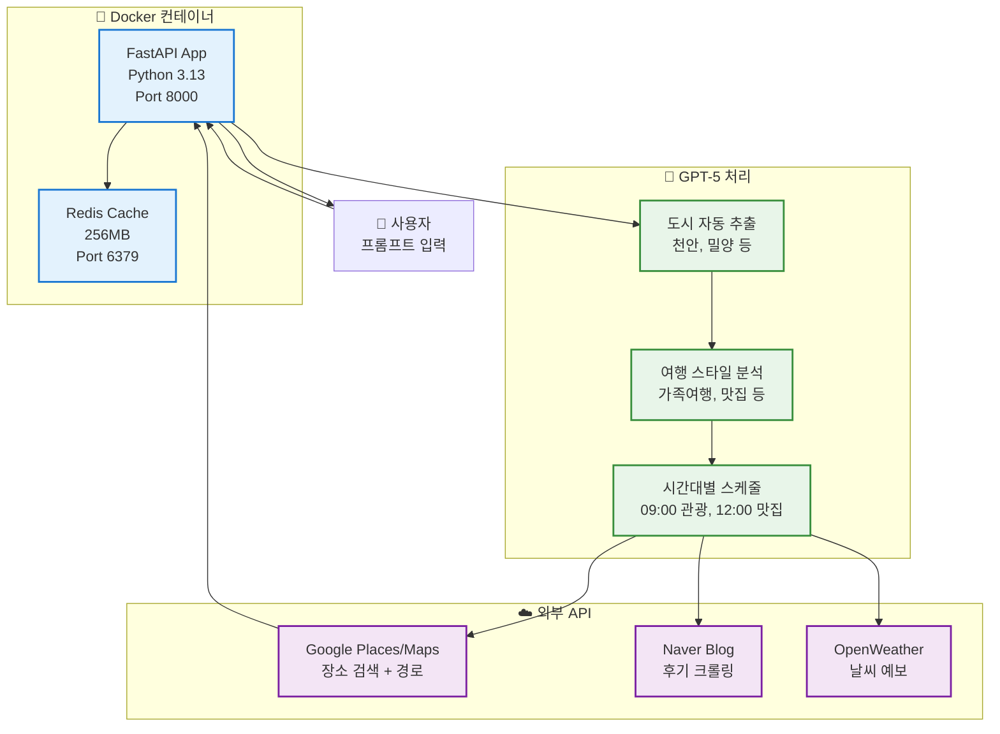
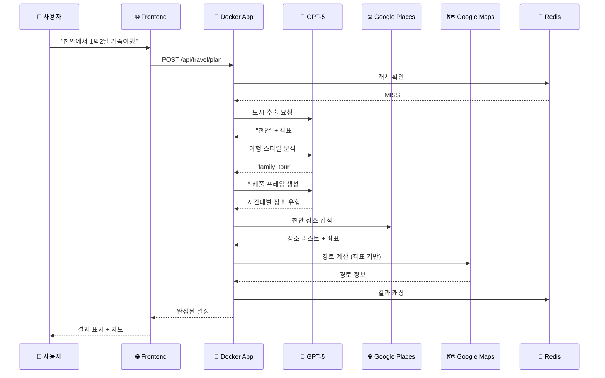

# 🇰🇷 AI 기반 한국 여행 플래너

> **"천안에서 1박2일 가족여행"** 한 문장으로 → GPT-5가 자동으로 완벽한 여행 일정 생성

[](https://python.org)
[](https://fastapi.tiangolo.com)
[](https://openai.com)
[](https://docker.com)
[](https://redis.io)

---

## 🎯 프로젝트 개요

**로그인 불필요, Docker로 즉시 실행** - 전국 모든 도시 지원!

### ✨ 핵심 특징 (2025-11-17 업데이트)

- 🤖 **GPT-5 도시 자동 추출**: 천안, 밀양, 청도, 합천 등 **전국 모든 도시** 지원
- 🎨 **프롬프트 중심 UI**: 여행 도시/스타일 선택 불필요, AI가 모두 자동 분석
- 📍 **좌표 기반 경로**: 동일 가게명 혼동 방지, 추천 장소의 정확한 위치로 경로 계산
- 🗓️ **AI 스케줄 프레이머**: 시간대별 최적 장소 유형 자동 결정
- 🔍 **순차적 장소 검색**: 이전 장소 기반으로 다음 장소 검색 (동선 최적화)
- 🌐 **Google Places API**: 실제 장소만 추천 (좌표, 주소, 평점 포함)
- 📝 **Naver 블로그 후기**: 각 장소마다 실제 방문 후기 자동 수집
- 🌦️ **날씨 기반 추천**: 실제 예보 반영한 실내/실외 활동 조정
- 💾 **Redis 캐싱**: AI 응답 및 장소 데이터 30일 캐시
- 🗺️ **좌표 기반 경로**: 도보/대중교통 자동 선택, 경로 없을 시 화살표 표시
- 🐳 **Docker 컨테이너**: Python 3.13 완벽 호환, 원클릭 실행

---

## 🚀 초간단 실행 (Docker)

### 1️⃣ Docker로 즉시 시작 (권장)

```bash
cd travel-recommend-korea
./docker-start.sh
```

**끝!** 브라우저에서 http://localhost:8000 접속! 🎉

### 2️⃣ 또는 Docker Compose 직접 실행

```bash
docker-compose up -d
```

### 3️⃣ API 키 설정

`.env` 파일에서 다음 키들을 설정하세요:

```bash
# 필수
OPENAI_API_KEY=sk-proj-your-key
GOOGLE_MAPS_API_KEY=your-google-key

# 선택사항
NAVER_CLIENT_ID=your-naver-id
NAVER_CLIENT_SECRET=your-naver-secret
OPENWEATHER_API_KEY=your-weather-key
NOTION_TOKEN=your-notion-token
```

---

## 📊 시스템 아키텍처



---

## ✨ 주요 기능

### 🤖 1. AI 자동 도시 추출 (NEW!)

```python
입력: "천안에서 1박2일 가족여행 추천해줘"
      ↓
GPT-5: "천안" 추출
      ↓
결과: 천안 장소들 추천 ✅
```

**지원 범위:**
- ✅ 천안, 밀양, 청도, 합천 등 소도시
- ✅ 전남, 경남 등 지역명에서 자동 추출
- ✅ 하드코딩 DB 없음 - AI가 모든 한국 도시 이해

### 🎨 2. 프롬프트 중심 UI (NEW!)

```
┌─────────────────────────────────────────┐
│  🤖 AI에게 여행 계획 요청하기           │
│  ┌───────────────────────────────────┐  │
│  │ 자연스럽게 입력하세요!            │  │
│  │                                    │  │
│  │ "천안에서 1박2일 가족여행"       │  │
│  │ "부산 해운대 데이트 코스"        │  │
│  └───────────────────────────────────┘  │
│                                          │
│  📅 날짜/시간 (선택사항)                │
│  🏠 출발지 (선택사항)                   │
│                                          │
│     ✨ AI 여행 계획 생성하기            │
└─────────────────────────────────────────┘
```

**특징:**
- ❌ 여행 도시 선택 불필요 (AI 자동 인식)
- ❌ 여행 스타일 선택 불필요 (AI 자동 분석)
- ✅ 프롬프트만 입력하면 끝!

### 📍 3. 좌표 기반 정확한 경로 (NEW!)

```
문제: "봉서산" 검색 → 파주 봉서산 찾음 ❌
해결: 좌표 (36.81, 127.12) 사용 → 천안 봉서산 ✅
```

**동작:**
- AI가 추천한 장소의 정확한 좌표 사용
- 동일 가게명의 다른 지점 혼동 방지
- 천안→전주→강릉 같은 중구난방 경로 방지

### 🗺️ 4. 우아한 경로 표시

```
대중교통/도보 경로 시도
   ↓
성공 → 파란/초록 선으로 경로 표시 ✅
실패 → 점선 화살표 표시 ✅ (에러 아님!)
```

---

## 🐳 Docker 구성

### 서비스 구조

```yaml
services:
  redis:
    - Redis 7 (256MB 메모리)
    - Port 6379
    - 30일 캐시 저장
    
  app:
    - FastAPI (Python 3.13)
    - Port 8000
    - 실시간 코드 반영 (볼륨 마운트)
```

### Docker 명령어

```bash
# 시작
./docker-start.sh
또는
docker-compose up -d

# 중지
docker-compose down

# 재시작 (코드 수정 후)
docker-compose restart app

# 로그 확인
docker-compose logs -f app

# 완전 삭제
docker-compose down -v
```

---

## 📁 프로젝트 구조

```
travel-recommend-korea/
│
├── 🐳 Docker 설정
│   ├── Dockerfile                  # Python 3.13 + 의존성
│   ├── docker-compose.yml          # Redis + App
│   ├── docker-start.sh             # 원클릭 실행 스크립트
│   └── .dockerignore               # 빌드 제외 파일
│
├── 🌐 frontend/                    # 프론트엔드
│   ├── index.html                  # 메인 페이지 (프롬프트 중심)
│   ├── script.js                   # JavaScript 로직
│   └── results.html                # 결과 페이지
│
├── 🔧 app/                         # FastAPI 백엔드
│   ├── main.py                     # FastAPI 진입점
│   │
│   ├── api/                        # API 엔드포인트
│   │   ├── endpoints.py            # 여행 계획 생성 API
│   │   └── user_endpoints.py       # 사용자 인증 API
│   │
│   ├── core/                       # 핵심 설정
│   │   ├── config.py               # 환경변수
│   │   └── database.py             # (PostgreSQL 제거됨)
│   │
│   └── services/                   # 핵심 서비스
│       ├── openai_service.py       # 🤖 GPT-5 통합
│       ├── hierarchical_location_extractor.py  # 🔍 AI 도시 추출
│       ├── enhanced_place_discovery_service.py # 📍 장소 발견
│       ├── google_maps_service.py  # 🗺️ 경로 계산
│       ├── blog_crawler_service.py # 📝 블로그 크롤링
│       ├── weather_service.py      # 🌦️ 날씨 조회
│       ├── route_optimizer_service.py  # 🎯 경로 최적화
│       └── local_context_db.py     # (빈 구현 - AI 대체)
│
├── ⚙️ 설정 파일
│   ├── .env                        # 환경변수 (API 키)
│   ├── requirements.txt            # Python 의존성 (3.13 호환)
│   └── .gitignore                  # Git 무시 파일
│
└── 📚 문서
    ├── README.MD                   # 이 파일
    └── TROUBLESHOOTING.md          # 트러블슈팅 가이드
```

---

## 🎨 사용법

### 1️⃣ 프롬프트 입력

```
예시:
• "천안에서 1박2일 가족여행 추천해줘"
• "부산 해운대에서 당일치기 데이트 코스"
• "제주도 3박4일, 아이들과 함께"
• "경주에서 역사 탐방 1박2일"
• "강릉 힐링 여행, 카페와 바다 중심으로"
```

### 2️⃣ AI 자동 분석

```
✅ 도시: 천안 (자동 추출)
✅ 기간: 1박2일 (자동 인식)
✅ 스타일: 가족여행 (자동 분석)
✅ 좌표: (36.81, 127.14) (자동 조회)
```

### 3️⃣ 결과 확인

- **일정 타임라인**: 시간대별 상세 일정
- **장소 정보**: 주소, 평점, 블로그 후기
- **지도 경로**: 좌표 기반 정확한 경로
- **자동 저장**: 브라우저에 최대 50개 저장

---

## 🔧 기술 스택

### 🐳 Docker
| 서비스 | 이미지 | 용도 |
|--------|--------|------|
| **app** | Python 3.13-slim | FastAPI 서버 |
| **redis** | Redis 7-alpine | 캐시 저장 |

### ⚙️ Backend
| 기술 | 버전 | 용도 |
|------|------|------|
| **Python** | 3.13.5 | 런타임 |
| **FastAPI** | 0.121.2 | 웹 프레임워크 |
| **Pydantic** | 2.12.4 | 데이터 검증 |
| **SQLAlchemy** | 2.0.44 | (미사용, 호환성) |
| **Redis** | 5.0.1 | 캐시 클라이언트 |
| **OpenAI** | 2.8.0 | GPT-5 SDK |

### 🤖 AI & External APIs
| API | 용도 | 캐시 |
|-----|------|------|
| **OpenAI GPT-5** | 도시 추출, 스타일 분석, 스케줄 생성 | 7-30일 |
| **Google Places** | 장소 검색 및 검증 | 30일 |
| **Google Maps** | 경로 계산 (좌표 기반) | 실시간 |
| **Naver Blog** | 후기 크롤링 | 30일 |
| **OpenWeather** | 날씨 예보 | 6시간 |

---

## 🆕 2025-11-17 주요 업데이트

### 1. Python 3.13 + Docker 완벽 호환

**문제:**
```
❌ psycopg2-binary: pg_config not found
❌ lxml: C API compilation error  
❌ SQLAlchemy: typing assertion error
❌ FastAPI: FieldInfo 'in_' attribute error
```

**해결:**
```
✅ Docker 컨테이너화
✅ requirements.txt 최신 버전
   - fastapi>=0.115.0 (0.121.2)
   - sqlalchemy>=2.0.30 (2.0.44)
   - pydantic>=2.7.0 (2.12.4)
   - lxml>=4.9.4 (6.0.2)
✅ Dockerfile에 빌드 도구 포함
   - gcc, g++, libxml2-dev, libxslt-dev
```

### 2. AI 자동 도시 추출 (전국 지원)

**기존:**
```python
# ❌ 하드코딩된 도시 DB (471줄)
KOREAN_LOCATIONS = {
    '서울': {...},
    '부산': {...},
    ...  # 20개 도시만
}
```

**개선:**
```python
# ✅ GPT-5 자동 추출
"천안에서 1박2일" → GPT-5 → "천안" ✅
"밀양 얼음골" → GPT-5 → "밀양" ✅
"청도 맛집" → GPT-5 → "청도" ✅
```

### 3. UI 단순화

**삭제:**
- ❌ 여행 도시 선택 드롭다운
- ❌ 여행 스타일 선택
- ❌ 예산 계산기
- ❌ 로그인/회원가입

**추가:**
- ✅ 프롬프트 중심 대형 입력창
- ✅ 로컬 히스토리 (최대 50개)
- ✅ 간소화된 UI

### 4. 좌표 기반 정확한 경로

**기존:**
```javascript
// ❌ 장소명으로 검색
origin: "봉서산"  
→ Google이 "파주 봉서산" 찾음 ❌
```

**개선:**
```javascript
// ✅ 좌표 직접 사용
origin: {lat: 36.81, lng: 127.12}
→ 정확히 천안 봉서산 ✅
```

### 5. 우아한 에러 처리

**경로 검색 실패 시:**
```
❌ 기존: 빨간 에러 메시지
✅ 개선: 파란색 정보 + 점선 화살표
```

---

## 🔄 데이터 플로우



---

## 🎓 핵심 기술

### 1. GPT-5 도시 추출

```python
프롬프트: "천안에서 1박2일"

GPT-5 요청:
"다음 문장에서 여행 목적지 도시명만 추출하세요.
규칙:
- '~에서' 뒤에 나오는 지명이 목적지
- 도/광역시 제거: '전남 순천' → '순천'
- 출발지가 아닌 목적지를 추출
JSON만 응답: {'city': '도시명'}"

응답: {"city": "천안"}
```

### 2. 좌표 기반 경로 계산

```javascript
// AI 추천 장소
{
  name: "카페루",
  address: "충청남도 천안시 동남구 서부대로 531-20",
  lat: 36.8149812,
  lng: 127.1290382
}

// 경로 계산
origin: {lat: 36.81, lng: 127.13}  // 좌표 직접 사용!
destination: {lat: 36.81, lng: 127.12}
→ Google Maps가 정확한 위치로 경로 계산
```

### 3. Redis 캐싱 전략

```
AI 응답 캐시: 7-30일
- 도시 추출
- 여행 스타일 분석
- 스케줄 프레임

장소 데이터 캐시: 30일
- Google Places 결과
- Naver 블로그 후기
- 날씨 정보: 6시간
```

---

## 📊 API 명세

### 여행 계획 생성

```http
POST /api/travel/plan
Content-Type: application/json

{
  "prompt": "천안에서 1박2일 가족여행 추천해줘",
  "preferences": {
    "city": "Auto",  // AI 자동 추출
    "start_date": "2025-11-20",
    "end_date": "2025-11-21",
    "start_time": "09:00",
    "end_time": "18:00",
    "start_location": "서울역"  // 선택사항
  }
}
```

### 응답 형식

```json
{
  "plan_id": "uuid",
  "title": "천안 1박2일 가족여행",
  "summary": "AI 생성 요약",
  "itinerary": [
    {
      "day": 1,
      "time": "10:00",
      "place_name": "독립기념관",
      "address": "충청남도 천안시 동남구 목천읍 삼방로 95",
      "lat": 36.7807,
      "lng": 127.2534,
      "duration": "90분",
      "description": "3·1운동 및 독립운동 자료 전시",
      "rating": 4.5,
      "blog_reviews": [...],
      "verified": true
    }
  ],
  "weather_info": {...},
  "route_info": {...},
  "processing_metadata": {...}
}
```

---

## 🐛 트러블슈팅

### 문제: Python 패키지 설치 실패

```bash
# 해결: Docker 사용 (권장)
./docker-start.sh
```

### 문제: 경로가 엉뚱한 곳으로

```
원인: 장소명으로 검색 (파주 봉서산)
해결: 좌표 기반 경로 계산 (수정 완료)
```

### 문제: innerHTML null 에러

```
원인: 제거된 UI 요소 참조
해결: null 체크 추가 (수정 완료)
```

### 문제: ZERO_RESULTS 에러

```
정상 상황: 경로 없음
처리: 점선 화살표로 자동 표시
```

---

## 💡 사용 팁

### 프롬프트 작성 팁

```
✅ 좋은 예:
"천안에서 1박2일 가족여행, 아이들 좋아할 만한 곳"
"부산 해운대 당일치기 데이트, 바다 뷰 카페 중심"
"제주도 3박4일, 렌터카로 자연 여행"

❌ 나쁜 예:
"여행" (도시 미지정)
"맛집" (도시, 기간 미지정)
```

### 출발지 검색 팁

```
1. 지도 아이콘 클릭
2. 검색창에 입력 (예: "서울역")
3. 자동완성 목록에서 정확한 위치 선택
4. 여러 후보 중 선택 가능 ✅
```

---

## ⚡ 성능

| 지표 | 값 |
|------|-----|
| **평균 응답 시간** | 8-15초 (캐시 히트 시 3초) |
| **캐시 히트율** | 40-60% |
| **지원 도시** | 전국 모든 도시 (무제한) |
| **동시 사용자** | Docker로 확장 가능 |

---

## 📞 API 키 발급

| 서비스 | 링크 | 필수 여부 |
|--------|------|-----------|
| **OpenAI GPT-5** | https://platform.openai.com/api-keys | ✅ 필수 |
| **Google Maps** | https://console.cloud.google.com/ | ✅ 필수 |
| **Naver API** | https://developers.naver.com/apps/ | ⭕ 권장 |
| **OpenWeather** | https://openweathermap.org/api | ⭕ 선택 |
| **Notion** | https://developers.notion.com/ | ⭕ 선택 |

---

## 🎯 장점

### vs 기존 여행 플래너

| 기능 | 기존 | 이 프로젝트 |
|------|------|-------------|
| 도시 지원 | 20개 (하드코딩) | **전국 무제한** (AI) |
| 입력 방식 | 드롭다운 선택 | **자연어 프롬프트** |
| 경로 정확도 | 장소명 검색 (혼동) | **좌표 기반** (정확) |
| 로그인 | 필수 | **불필요** |
| 설치 | 복잡 (가상환경) | **Docker 원클릭** |
| 확장성 | 제한적 | **AI 기반 무한** |

---

## 🌟 향후 계획

### ✅ 완료된 기능 (2025-11-17)
- [x] Docker 컨테이너화
- [x] Python 3.13 완벽 호환
- [x] AI 자동 도시 추출
- [x] 프롬프트 중심 UI
- [x] 좌표 기반 경로
- [x] 하드코딩 DB 제거

### 🚧 다음 단계
- [ ] Google Places Autocomplete → PlaceAutocompleteElement 마이그레이션
- [ ] Google Marker → AdvancedMarkerElement 마이그레이션
- [ ] SSE 스트리밍 진행률 표시 개선
- [ ] 다국어 지원 (영어, 중국어, 일본어)

---

## 📄 라이선스

MIT License - 자유롭게 사용, 수정, 배포 가능합니다.

---

## 🙏 크레딧

- [FastAPI](https://fastapi.tiangolo.com/) - 웹 프레임워크
- [OpenAI GPT-5](https://openai.com/) - AI 도시 추출 및 분석
- [Google Maps](https://developers.google.com/maps) - 지도 및 경로
- [Redis](https://redis.io/) - 캐시 저장
- [Docker](https://docker.com/) - 컨테이너화

---

<div align="center">

## 🎯 지금 바로 시작하세요!

```bash
./docker-start.sh
```

**브라우저에서 http://localhost:8000 접속!**

### 🌟 주요 기능
✅ 전국 모든 도시 | 🤖 AI 자동 분석 | 📍 정확한 경로 | 🐳 Docker 원클릭

*Made with ❤️ using FastAPI, OpenAI GPT-5, Google Maps, and Docker*

[⭐ Star this repo](https://github.com/your-repo/travel-recommend-korea) | [🐛 Report Bug](https://github.com/your-repo/travel-recommend-korea/issues) | [💡 Request Feature](https://github.com/your-repo/travel-recommend-korea/issues)

</div>
